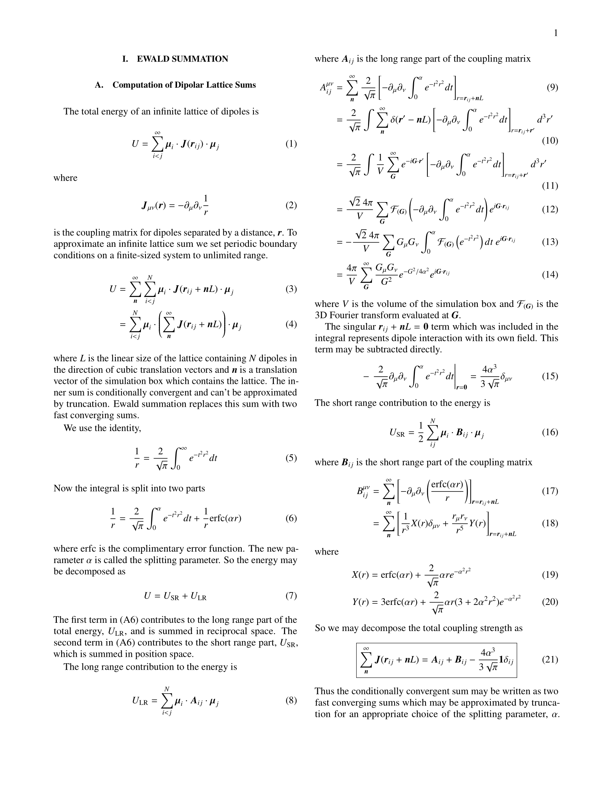
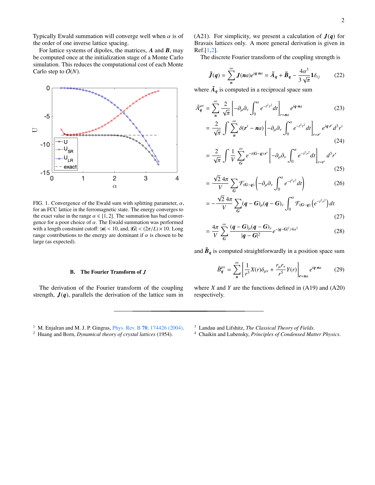

# Ewald Summation for Lattice Dipoles

Calculates the coupling matrix using the Ewald summation method and runs Monte Carlo simulations for classical (Heisenberg) point dipoles on the simple cubic lattice at various temperatures in parallel. Results from an older version of this code are featured in a publication by Bovo et. al. on special tempuratures of magnetic systems with competing ferromagnetic and antiferromagnetic order.

[Nature Communications volume 9, Article number: 1999 (2018)](https://doi.org/10.1038/s41467-018-04297-3)

